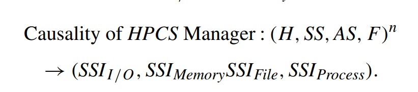

# Dynamic Reconfiguration

## Context Centric Cluster Computing (C4) in Ad Hoc Network (2016)

Authors [Annadurai and Vijayalakshmi](Context_Centric_Cluster_Computing.pdf) describe the challenges of efficiently managing dynamic cluster configurations. These dynamic systems can add and remove nodes at arbitrary intervals, and the loss of these nodes can influence the availability of desirable routes.

An example scenario would be _Mobile Adhoc Networks_ (MANET), which are used by first responders to large scale disasters. The disaster might have destroyed the existing communication infrastructure. These responders might form a mesh, where each smart phone operates as packet forwarding device. Then ad hoc routes can be formed by bouncing through the mesh to an eventual gateway point. In these scenarios users will walk into/out of range causing the availability paths to those gateways to be volitial.

Another scenario could be services that run on _Amazon Spotfleet_, a very economical compute fabric that does not offer any redundancies. The hosts are permitted to disappear after a two minutes notice. In exchange for accepting these limitations, developers can run their code for pennies on the dollar.

### Security Considerations of C4

One of the challenges within these ad-hoc networks is to ensure the security of peer-to-peer messaging. The authors propose a standard public/private key infrastructure that is based on certificate exchange. What makes there scenario interesting is that the _Cluster Head_ nodes are permitted to join and disjoin similar to the _Cluster Worker_ nodes.

As these head nodes drift out a mechanism is required to rekey all the worker nodes. This mechanism needs to limit the volume of communication for control operations as this reduces the bandwidth for "actually doing stuff."

### How did they address these issues

To address these complexities the authors decomposed the MANET into segments, and then formed a tree structure to connect them. At each junction a stack of previous key states were maintained.

When a new head node joined the environment the junction would rekey itself, and push that key onto the stack. This because the preferred key for communicaiton within the ring. If that head node fell out of scope, then the stack was popped and all nodes reverted to the previous key.

This pattern reduces the number of broadcasts required as there is a fallback entity.

## AMRC: an algebraic model for reconfiguration of high performance cluster computing systems at runtime (2013)

The authors [Khaneghah and Sharifi](Alegbraic_model_for_reconfigurable_clustering.pdf) discuss the requirements of dynamically scaling compute clusters at runtime instead of design time. As the shape of the environment can become elastic, there are several advantages to both costs and operational economics.

### What are the requirements of dynamic configurations

  A dynamic HPCS with dynamic state is considered as the underlying platform, and they investigate changes caused by sudden and asynchronous behaviors of communication, scheduling mechanisms, heterogeneity of processes, and workload changes, as well as effects of workload changes in performance of the load balancing algorithm. Based on these investigations, some approaches for improving workload algorithm in situations with high frequency of changes are introduced. They have proposed four rules, which must be considered in any load balancing algorithm. 

These rules are:

1. load measurement
2. information rules
3. initiation rule
4. load balancing operation

### Distortion between the personas

In legacy systems it was possible for the problem expert to demostrate full knowledge of all aspects of the problem. These included constraints, capabilities,and management of the executive elements.

However, in modern systems there are multiple vantage points that are trying to optimize the same problem. This leads to distortion between the roles that needs to be managed through some mechanism.

- Problem Expert: The domain expert that is trying to provide a end user solution
- Executive Expert: Refers to the subsystem that manages response structures
- System Expert: Refers to the subsystem that is trying to manage resource allocations
- HPCS Manager: Refers to the subsystem that manages the configuration

  The general approach in the AMRC model is that the HPCS management system must be able to determine new changes and requirements of dynamic processes. The HPCS management system must also compare these changes and requirements to a main indicator existed in the time of system’s stability.

### What is the "five-phases design model"

- Phase 1: Problem and HPCS experts cooperate.

- Phase 2: Problem’s experts form a set named _Problem Technical Accounting_ (PTA), based on problem features, including: 
  - its constraints 
  - special features 
  - requirements
  - technical information

- Phase 3: HPCS experts design and develop the HPCS management system based on the PTA set and set of available resources in the system. The HPCS management
system must control system resources in a way that each process, within its lifetime, behaves with the entirety of resources in the system as if they are local resources.

- Phase 4: The nature of the problem nature is static, and its processes are static as well. The HPCS manager executes processes based on the PTA set, which is static.

- Phase 5: HPCS experts leave the system, and the system enters execution phase.

#### What is the sixth phase (abstract idea)

  Phase 6 The HPCS expert is notified that the nature of the PTA set has changed. On the other hand, the HPCS is executing processes. At this moment, either the HPCS expert must change its position from an external entity to an internal entity to reconfigure the system or direct the system to a suspend state, after which it can reconfigure the HPCS based on the new PTA set, which is of course very time consuming.

### Principals of Design

- T1, is derived from the underlying philosophy of the HPCS experts that consider HPCS as a problem solver that _a scientific problem is as an input, and outputting is a solution to it_. Therefore, our first principle is to _map the resource requirements of a problem space to a solution space_ by adapting the
capabilities of the solving nature.

- T2, is that the dynamic nature of twenty-first century processes is not mutually exclusive to their processing behavior (dimension). Any change in the four-dimensional process management expressed in T2 principle can cause violation of customization and T1 principles. The second point is that Single System Image (SSI) concept can only be considered as the goal of an HPCS if it can be applied to other dimensions of a process.

- T3, the effective elements in the HPCS and heterogeneity of elements can be classified into four general spaces. Three of them are `hardware`, `application software`, and `system software`, and [...] [t]he fourth space that was considered in design of exascale computing is `Functionality`.

  In fact, HPCSs are built from independent communicative computers with the same or different hardware features and capabilities (H). They may run under the same or different system software (SS); they may execute the same or different (parts or whole of) application software (AS), and they may provide the same or different functionalities (F). This is to say that the elements (members) of HPCS can be heterogeneous in H, SS, AS, and F; this is our meaning of heterogeneity.

