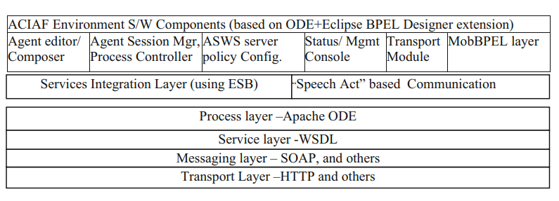

# Business Process Execution Language

Authors [Venkatesan and Sridhar](Arch_NextGen_EnterpriseScale.pdf) discuss extensions for BPEL, a workflow technology for orchestrating web service calls.

Located within this same folder are PowerPoint decks detailing both the `Business Value` and `Technical Overview` of the BPEL standard.

## Business Model Programming

One of the key advantages of using BMP-style languages, is that they are inheritely visual by design. For instance, it is trivial to produce a flowchart from a BMP diagram.

These flowcharts are also [Petri networks](https://en.wikipedia.org/wiki/Petri_net) and can further reduced into mathmatical expressions. These expressions are verifable, making it possible to detect at compilation time several runtime errors (e.g. deadlocks).

## Programming Model

Their implemenetation relies on [Apache Orchestration Director Engine (ODE)](https://ode.apache.org/) to execute their Xml based job definitions. A _Programming in the large / Programming in the small pattern_ is used to implement the job.

*Programming in the Large* refers to the high level language that uses Xml tags to describe the invocations to various _actions_.
*Programming in the Small* refers to the Java code behind that implement individual _action_.

The pattern allows a decoupling of design for business level domain experts from the code monkeys.

## ACtive Internet Application Framework

BPEL natively supports performing _Remote Procedure Calls_ by marshalling data structures to web endpoints. The operation binding is discovered through Web Service Description Language (WSDL).

The authors extended BPEL to incorporate other cloud standards such as `WS-Addressing` and `WS-Security`. These open standards enable numerous interop scenarios with third-parties and existing tools.

### Code Mobility

They also considered additional Web 3.0 concepts, which is a fancy way of referring to the ubiquitous mobile computing movement. The vision states that scenarios are continously occuring in a highly reliable manner that is individually personalized.

Mobility extensions require capabilities for starting the workflow via message received from endpoints, and weaving send/wait to client operations. These are relatively simple concepts on the surface, though their async nature introduces suddle complexities.

To manage these complexities an _Agent Model_ is leveraged, where the device and/or third-party services are treated as stateless objects to perform the operation and report back.

### Reliability is the Responsibility of Client

There are two locations that retry logic can be placed on the client or at the service. While it has been argued that the service/provider is the correct location, this does not work for mission critical systesm. The reason is that if catestrphic failure occurs (e.g. host failure) the provider is dead and cannot continue.

Instead the logic needs to reside within the client or the introduction of a service broker introduced. If the broker can durably persist the message from the client then it can accept acknowledge a postive handoff. Though even in this scenario the broker has transitioned to becoming the next client in the change. Thus it is again the responsibility of the client to ensure the message is not lost.
