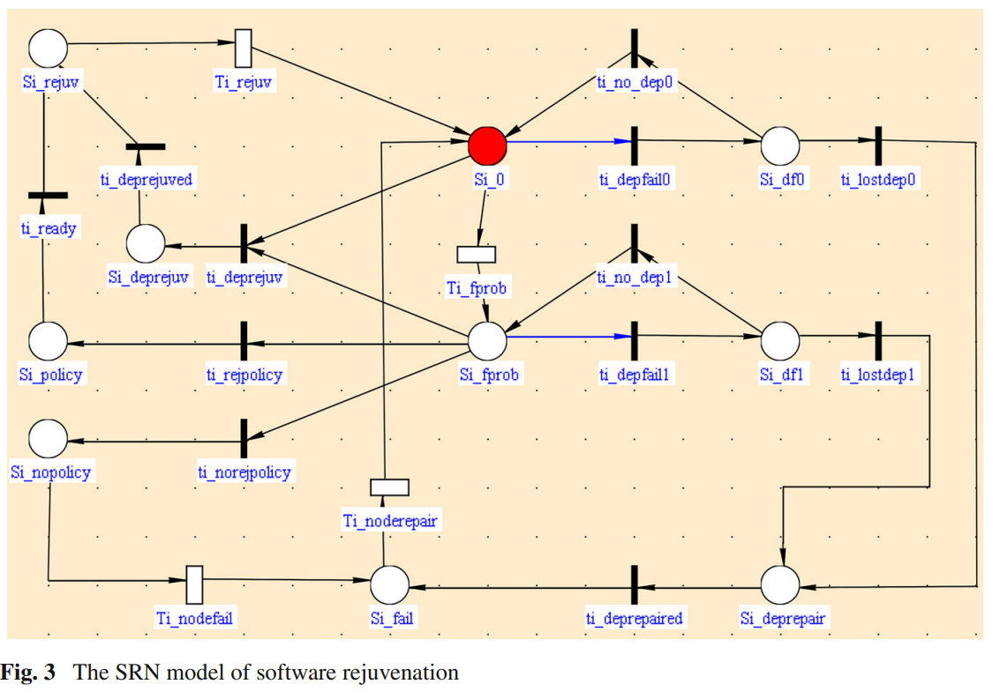

# Fault Management Strategies

## Software rejuvenation in cluster computing systems with dependency between nodes (2013)

The authors [Menghui Yang, Geyong Min, Weikang Yang, and Zituo Li](Software_Rejuvenation_in_clusters_with_dependencies.pdf) describe challenges within _software aging_, which is increased error state that follows after software systems have been running for a long period of time. It is caused by all of the baggage, such as leaked handles and minor memory corruption. Eventually the system will crash and the outage will impact the customer.

To mitigate these challenges they propose models to periodically restart the internal state, such as refreshing worker processes or spawning new worker threads. Through the use of _self-healing strategies_ the failure rate of the system can be drastically reduced and the reliability increased.

### Analytical versus Model Approaches

> There are two basic approaches to apply the prediction for software rejuvenation: (a) analytic-based approach; (b) measurement-based approach.

An analytical approach uses a system metric to determine if a component is within an acceptable state. For instance, memory usage could be tracked and as a leak causes the working set to approach a limit, then recycle the process.

Model approaches can use _Markov Regression Theory_ to predict that _same component will exceed the same threshold_ within `mean=1 day, stddev=0.25 days`. Then based on these figures, the system might statically reset the process every +/-18 hours.

### Implementing Rejuvenation Strategy

The authors propose first segmenting the nodes within the cluster into distinct `utility categories`, such that each node is only in one category.

Each segment is then modeled with [Stolcastic Rewards Net](Background/StochasticRewardNets.pdf)(see `Section 2: Stochastic Reward Nets: A Gentle Introduction`) -- which are essentially Markov chains with variable rewards placed on each state transition. The system then `transitions` between states and compensations are applied as needed.

While a lot of research has been invested in SRN-based rejuvenation, there has been less that takes into account the influence dependency management. For instance, in a dispatcher-worker model there might need to be different policies for each subsystem.

These policies execute it could force compensations on through the dependency tree. Consider, the scenario where the worker recycles _after 1 hour or when the memory usage exceeds X megabytes_. However, if the dispatcher cycles it could be easier to also recycle the workers so that they are properly reinitialized.

There can be multiple remediation policies with different weights, with each weight representing the probabililty and/or cost of applying the strategy. Perhaps rebooting the entire cluster has a 100% success rate but the cost is 15 minutes of downtime. Meanwhile, live migrating the virtual machines to a new host has a 30% chance with cost of 1 minute downtime + 2 hours of manual effort. Which is the better choice?

