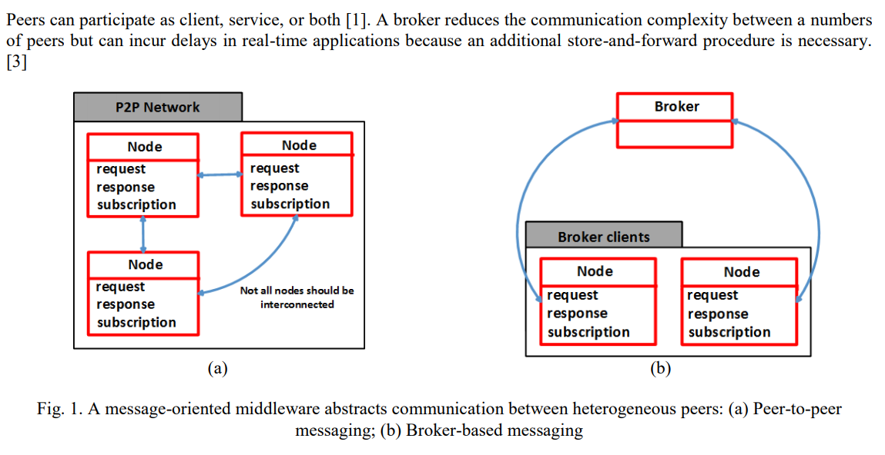

# Messaging and Eventing Protocols

The authors [Stipe Celar, Eugen Mudnic & Zeljko Seremet](State-of-the-art-Messaging.pdf) discuss common products, protocols, and patterns for eventing within distributed systems.

## Message Oriented Middleware

A common pattern for cloud systems is to use loosely coupled message passing between components. The producer and consumer are required to use the same data schema and transport configuration, but can be completely heterogeneous past this.

Typically these communication _cross cutting concerns_ are encapsulated as components. The components are triggered at various lifecycle points throughout the event processing (e.g. send/receive).

## Broker Based Models

The communication can take place across an _event broker_ or _peer-to-peer_. When events flow through a broker there are additional latencies, however it is possible to centrally apply policy. The benefits of policy based routing was covered extensively in [TIM-7010-Computer_Networks_and_Mobile_Computing](https://github.com/dr-natetorious/TIM-7010-Computer_Networks_and_Mobile_Computing) -- specifically `Section 1` and `Section 4`.

As the model becomes more decentralized into peer-to-peer, there are scalability improvements due to operations spreading over more nodes. However, this comes with additional complexity as security and reliability become the responsibility of a larger attack surface.

### Interaction Patterns

In terms of interaction patterns, a trivial message queue allows bilateral Send and Receive, for asynchronous
messaging, and multilateral One-to-Many Send, e.g., publish-subscribe. Using message queues in a broker architecture
allows to implement sophisticated routing patterns. In general, a MOM is characterized by Curry [1]:

- Messaging specification. A MOM needs to specify th format of messages and transport mechanisms. Interconnectin
proprietary MOM systems is achieved through adapters or bridges.
- Message filtering. A core functionality of a MOM is filtering for message delivery. Curry [1] distinguishes:
  - A channel-based system offers predefined groups of events as channels, where clients can subscribe to.
  - Messages in a subject-based system carry metadata in the message header, e.g., a subject. A client subscribes
messages, where the metadata matches some given pattern.
  - In a content-based system, a client subscribes messages, where the message body satisfies a set of properties
expressed in a query language.
  - Composite events functionality extends a content based filtering with property matching across sets or
sequences of messages.
- Message transformation. Messages can originate from various heterogeneous sources and consequently carry all
kinds of content types as payload. A MOM can offer APIs to modify messages, e.g., XML transformations.
- Integrity, reliability, and availability. A MOM can have properties to increase the overall Quality-of-Service:
  - Transactions and Atomic Multicast Notification;
  - Reliable message delivery: at-least-once, exactly-once, or at-most-once;
  - Guaranteed message delivery by acknowledgments;
  - Prioritization of messages;
  - Load balancing over several brokers or queues; and
  - Message broker clustering for fault tolerance.

A MOM is typically accessed through an API to abstract the technical details of message exchange. Due to the
transport-agnostic design of SOAP/WS-* services, a MOM can also serve as a transport mechanism for SOAP
messages.

## Protocols Detailed

- RESTful Messages: Typical asp.net/json endpoint patterns
- Microsoft Message Queue (MSMQ): Highly durable message queing technology that is part of the Windows Operating System
- Advanced Message Queue Protocol (AMQP): Web Socket based solution for message queues (e.g. Azure Sevice Broker)
- Extensible Message and Presence Protocol (XMPP): Originally used by instant message clients for handling delivery between clients with sparatic online availability.
- Message Queue Telemetry Transport (MQTT): Internet of Things use this for Machine to Machine (M2M) publish/subcribe eventing scenarios.

## Discussed Products

- Apache Kafka: Distributed publish/subscription platform with guarenteed delivery mechanisms
- Polygot Message Brokers: Apache MQ, RabbitMQ, and similar products function as adaptors for `X to Y` protocol binding. This further reduces the dependencies between producers and consumers.
