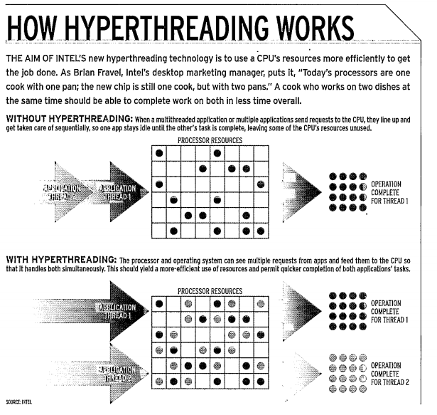

# Processor Scheduling Articles

## Two CPUs in One (2003)

The author [Mainelli](TwoCpus_In_One.pdf) reports on the performance impact of Pentium Hyperthreading on Windows XP.

Intel's promise was that applications would magically receive benefit, however it was discovered that very few applications correctly handled this case; and some even slowed down.

The slow down was attributed to splitting the memory buffers in half for each virtual processor. There was additional complexities as many applications were not designed to respond to multi-core machines.



## Spectre Attacks: Exploiting Speculative Execution (2018)

The authors [Kocher et al.](SpectreAttack.pdf) describe an issue with the branch prediction features that exist within modern processors. These devices use heuristics to precompute likely code branches during idle cycles. If those branches are taken, then the results are committed otherwise they are discarded.

    More specifically, consider an example where the program’s control flow depends on an uncached value located in external physical memory. As this memory is much slower than the CPU, it often takes several hundred clock cycles before the value becomes known. Rather than wasting these cycles by idling, the CPU attempts to guess the direction of control flow, saves a checkpoint of its register state, and proceeds to speculatively execute the program on the guessed path. When the value eventually arrives from memory, the CPU checks the correctness of its initial guess. If the guess was wrong, the CPU discards the incorrect speculative execution by reverting the register state back to the stored checkpoint, resulting in performance comparable to idling. However, if the guess was correct, the speculative execution results are committed, yielding a significant performance gain as useful work was accomplished during the delay. 
    
    From a security perspective, speculative execution involves executing a program in possibly incorrect ways. However, because CPUs are designed to maintain functional correctness by reverting the results of incorrect speculative executions to their prior states, these errors were previously assumed to be safe.

Given enough iterations of `x > 0` the branch predictor will learn to pre-execute the expression `array[x]` and fetch the value from memory into the local cache. When `x` is negative or out of bounds the processor abandons those pre-executions however the cache is still populated.

This behavior leads to the tedious task of enumerating through memory and paging each value one `wORD` at a time. There are likely optimizations to load entire cache lines though this was not discussed in the literature.

```c++
    if (x > 0)
        array[x] = taco;
```
