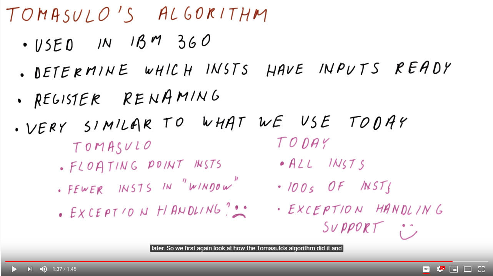
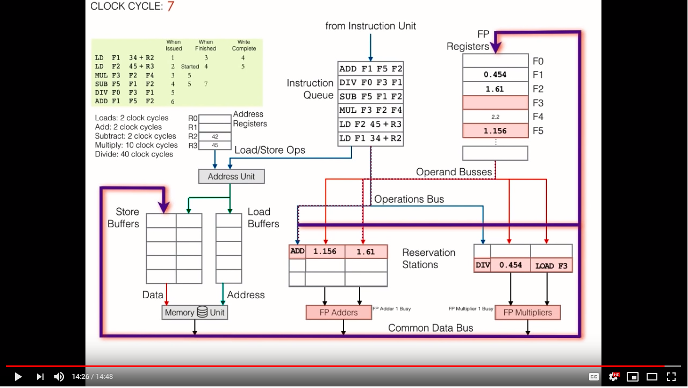
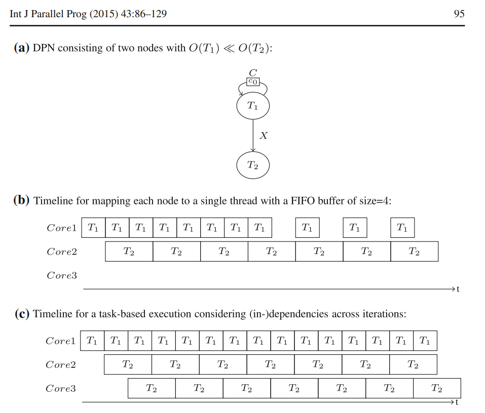

# Processor Scheduling Articles

## Two CPUs in One (2003)

The author [Mainelli](TwoCpus_In_One.pdf) reports on the performance impact of Pentium Hyperthreading on Windows XP.

Intel's promise was that applications would magically receive benefit, however it was discovered that very few applications correctly handled this case; and some even slowed down.

The slow down was attributed to splitting the memory buffers in half for each virtual processor. There was additional complexities as many applications were not designed to respond to multi-core machines.


## Spectre Attacks: Exploiting Speculative Execution (2018)

The authors [Kocher et al.](SpectreAttack.pdf) describe an issue with the branch prediction features that exist within modern processors. These devices use heuristics to precompute likely code branches during idle cycles. If those branches are taken, then the results are committed otherwise they are discarded.

    More specifically, consider an example where the program’s control flow depends on an uncached value located in external physical memory. As this memory is much slower than the CPU, it often takes several hundred clock cycles before the value becomes known. Rather than wasting these cycles by idling, the CPU attempts to guess the direction of control flow, saves a checkpoint of its register state, and proceeds to speculatively execute the program on the guessed path. When the value eventually arrives from memory, the CPU checks the correctness of its initial guess. If the guess was wrong, the CPU discards the incorrect speculative execution by reverting the register state back to the stored checkpoint, resulting in performance comparable to idling. However, if the guess was correct, the speculative execution results are committed, yielding a significant performance gain as useful work was accomplished during the delay. 
    
    From a security perspective, speculative execution involves executing a program in possibly incorrect ways. However, because CPUs are designed to maintain functional correctness by reverting the results of incorrect speculative executions to their prior states, these errors were previously assumed to be safe.

### How does it work

Given enough iterations of `x > 0` the branch predictor will learn to pre-execute the expression `array[x]` and fetch the value from memory into the local processor cache. This cache is shared between the various system processes but protected from direct access by the virtual memory system.

```c++
    if (x < array1_size)
        y = array2[array1[x] * 4096];
```

Low rights processes are capable of evicting the shared processor cache line entries. Since the user controls `x` and `array1` they can cause cache miss that loads `physical_mem[k]` into `processor.cache[base_address + *physical_mem[k])]`. Then by checking the time required to access the cache line can of `processor.cache[base_address + offset]` determine if that value was in the cache or fetched from memory.

If the value `base + offset` was quickly returned from the local cache, then we know that `phyisal_memory[k]` must equal `offset`.

    For this example, a simple and effective gadget would be formed by two instructions (which do not necessarily need to be adjacent) where the first adds (or XORs, subtracts, etc.) the memory location addressed by an attacker-controlled register R1 onto an attacker-controlled register R2, followed by any instruction that accesses memory at the address in R2. In this case, the gadget provides the attacker control (via R1) over which address to leak and control (via R2) over how the leaked memory maps to an address which is read by the second instruction. 

## Evaluation of Speculation in Out-of-Order Execution of Synchronous Dataflow Networks (2013)

The authors [Daniel Baudisch, Klaus Schneider](Eval_Speculation_OutOfOrder_Sync_Dataflow_Networks.pdf) draw a parallel between between the execution of synchronous dataflow networks (DFN) and hardward processor execution. In both scenarios, tasks need to be performed with loose ordering of events.

To extend on previous work they hypothesized that it would be possible to also include specualative execution within the DFN, by executing tasks that were likely to follow with probable combinations. These results are then cached with an appropriate Time to Live (TTL) and used, `iff` they are actually needed. This results in faster performance for the default case as idle time was more efficiently used.

### Tomasulo's Out of Order Execution Algorithm

> Tomasulo, R.: An efficient algorithm for exploiting multiple arithmetic units. IBM J. Res. Dev. 11(1), 25–33 (1967)

This [Georgia Tech video](https://www.youtube.com/watch?v=PZZvhqnch5o) describes what Tomasulo's algorithm does and is more verbosely detailed [here](https://www.youtube.com/watch?v=jyjE6NHtkiA).





### Motivations for this approach



### Time-Insenstive Speculation Check

A speculated task is assumpted to be performed with an idempotent action, that will return the same value for the same parameter set. This requirement makes it easy to check a speculated result is useful, as its parameter values become the primary key in the lookup table.

    The easiest way to handle races is to ignore them at the point of the speculation. When a speculation result is being checked, we simply compare all inputs that actually have been used by the task. This is done by an additional function which is created by our code generator. The behavior of each node is deterministic. Hence, applying a task’s function to the same inputs will always yield the same outputs. In turn, if the inputs of a speculation and the actual inputs of a pending task are equal, then the speculation result is exactly the same as the result of the non-speculative execution.

One of the challenges with this approach is that the speculated task is scheduled before the antagionous task, but could end afterwards. This enables a race condition that can be avoided by placing timestamps on the results. Then the timestamp can be used to determine which value should be committed into memory.

The authors relied on a centralized network time service as the source of truth. This mitigated the scenario where clock skew will cause the wrong value to be selected.
