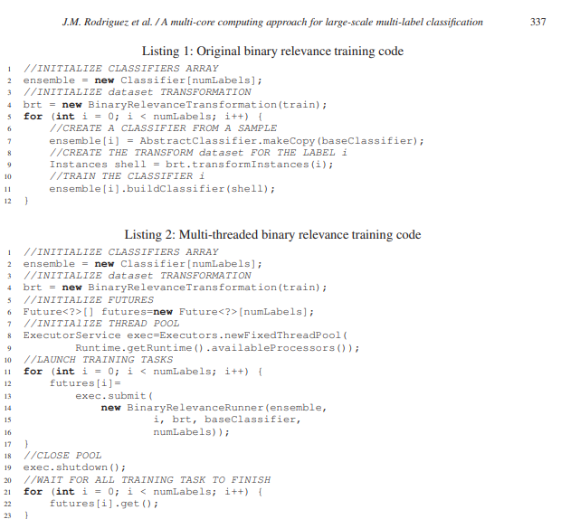

# Use Cases of Distributed Hardware Systems

## High Performance Cluster Computing as a Tool for 4G Wireless System Development (2014)

Authors [Thiele, Wirth, Oblrich, Schierl, Haustein, and Frascolla](HPC_and_4G_Wireless.pdf) discuss the challenges with building a Digital Signal Processor (DSP) with software. These scenarios frequently arise within video encoding as realtime images need to be transmitted to the audience.

### Transitioning to Virtual Network Functions

Histroically, these systems have been built with hardware, which has made them expensive to operate and limits innovation. Instead the systems need to transition to Virtual Network Functions (see [TIM-7010-Computer_Networks_and_Mobile_Computing](https://github.com/dr-natetorious/TIM-7010-Computer_Networks_and_Mobile_Computing) Section 1).

As VNF components, they can be dynamically provisioned and upgraded in a highly efficient manner. Operational costs are also reduced as shared hardware can be used instead of dedicated machines.

### Introducing High Performance Clusters

However there are challenges with software performing at the same speeds as hardware. One approach has been to deploy FPGA controllers as they can fill the hybrid space of hardware speeds with software agility.

Another strategy is to improve the encoding algorithms so they can be performed in parallel across multiple rendering nodes. The authors took this approach and configured a _High Performance Computing Service_ (HPCS) cluster. This was able to accept arbitrary tasks and schedule those processes on free nodes within the multi-server environment.

### Running Code at the Data

High resolution video can quickly grow to enormous scale. Instead of moving this data around the data center, the paper proposes moving the code to execute "directly" on the storage nodes. This pattern is well documented in other big data solutions, such as Hadoop.

## A multi-core computing approach for large-scale multi-label classification (2017)

Authors [Juan Manuel Rodriguez∗, Daniela Godoy, Cristian Mateos and Alejandro Zunino](Multi-Core-LargeScale-Label_Classification.pdf) investigated strategies for reducing the time required to train label classification models.

A label classification model might try to identify aspects within images or video, such as "the image contains a cat." These labels are provided to the supervised learning algorithm as free form text. The model then needs to rationalize these free form texts and determine that the e.g. "kitten" label is also a "cat" label.

Many researchers have looked at improving the accuracy of these problems, though there has been limited consideration of speeding up the building of these models. The authors explored the topic and found that various mainstream Machine Learning libraries do not handle multi-threaded code.

Because these libraries are running single threaded, multi-core systems are oftne poorly utilized and are mostly idle despite the large backqueue of work.

### How did they improve compute utilization

The crux of their solution was modifying the scheduling algorithm to decompose large units of work into small tasks. Each task could then be scheduled in parallel with an affinity to a particular core.

Since, these tasks are extremely CPU bound care was taken to reduce over scheduling and introducing thread context switching. As tasks completed the next task is pulled from a local list and scheduled onto that physical core.

The authors state that this approach scaled linearly and only used +/- 3% overhead versus a theoritical maximum throughput. 

### How did they improve storage utilization

Another challenge with large scale label analysis is the sparse matrices can grow huge quickly. This can prevent them from fitting within RAM on the processing nodes.

They introduced an object cache store that automatically paged to disk, making it virtually unlimited in size. Within the cache layers `WeakReference<T>` are used to allow garbage collection to continue functioning. If the referenced data is collected, then the `CacheItem<T>` will trigger the page fault and retrieve the underlying data.

