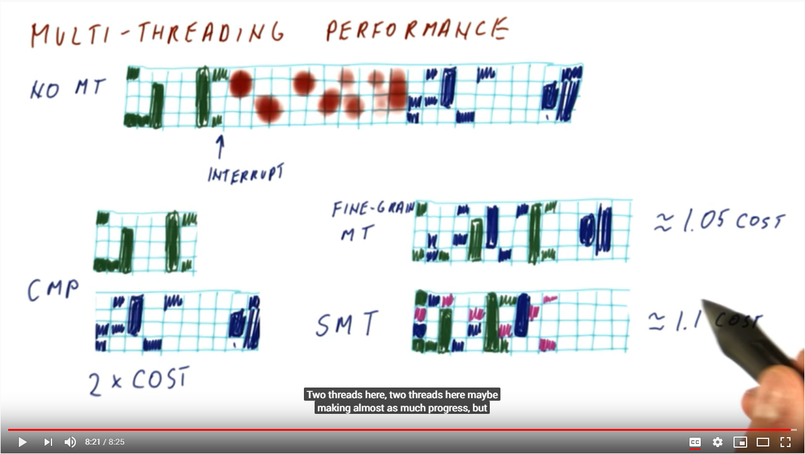

# Videos on Hyper Threading

## Marketing video from Intel

This [marketing video](https://www.intel.com/content/www/us/en/architecture-and-technology/hyper-threading/hyper-threading-technology.html) from Intel provides an analogy that Hyper-Threading is _converting a one lane highway, into two lane_. More cars can drive down the same road.  

## Multi Threading Performance - Georgia Tech - HPCA

These [videos from Georgia Tech](https://classroom.udacity.com/courses/ud007/lessons/3650589023/concepts/9999288670923) were beneficial to understanding the mechanisms to processor scheduling. The HPCA course is available for free on udacity.

