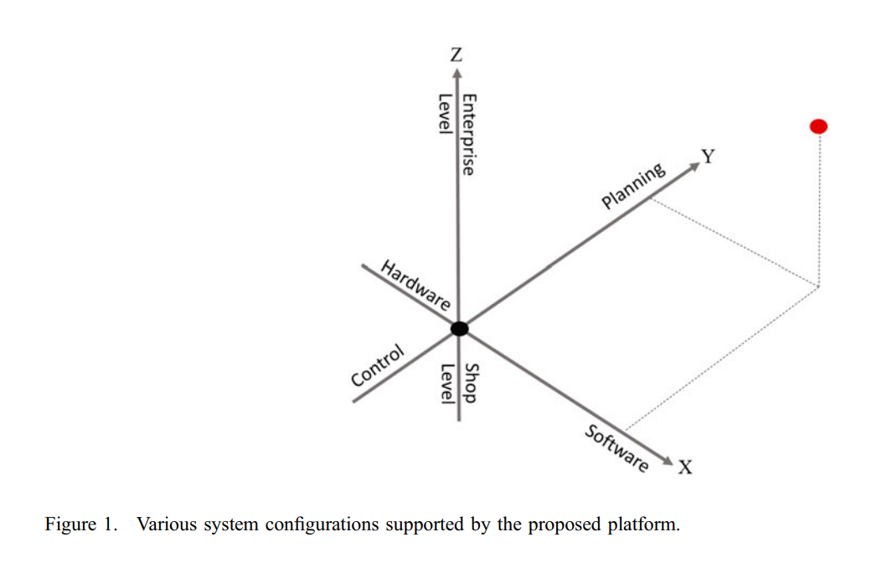
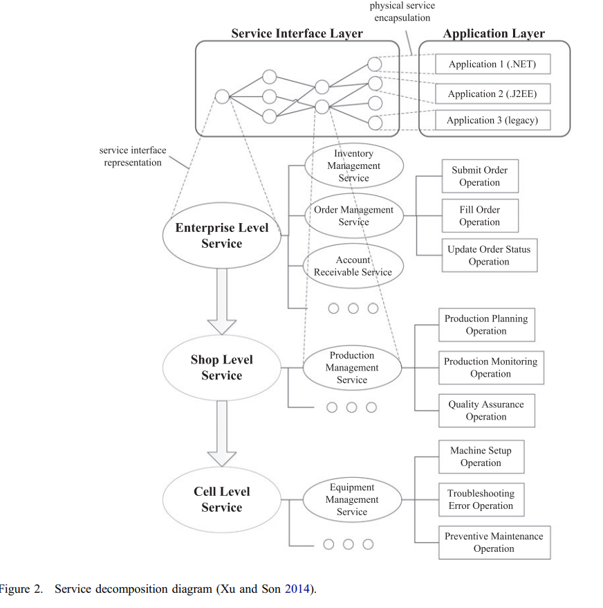
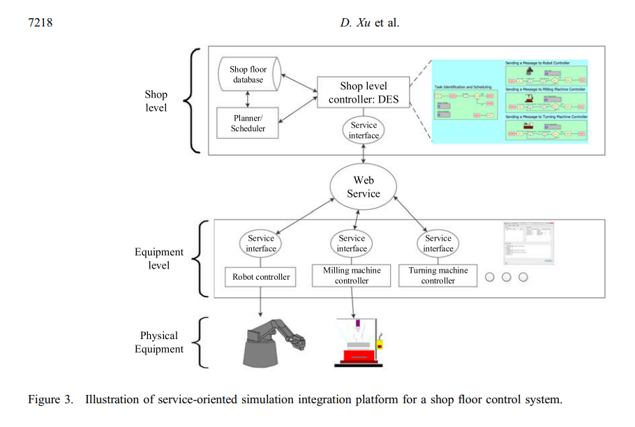
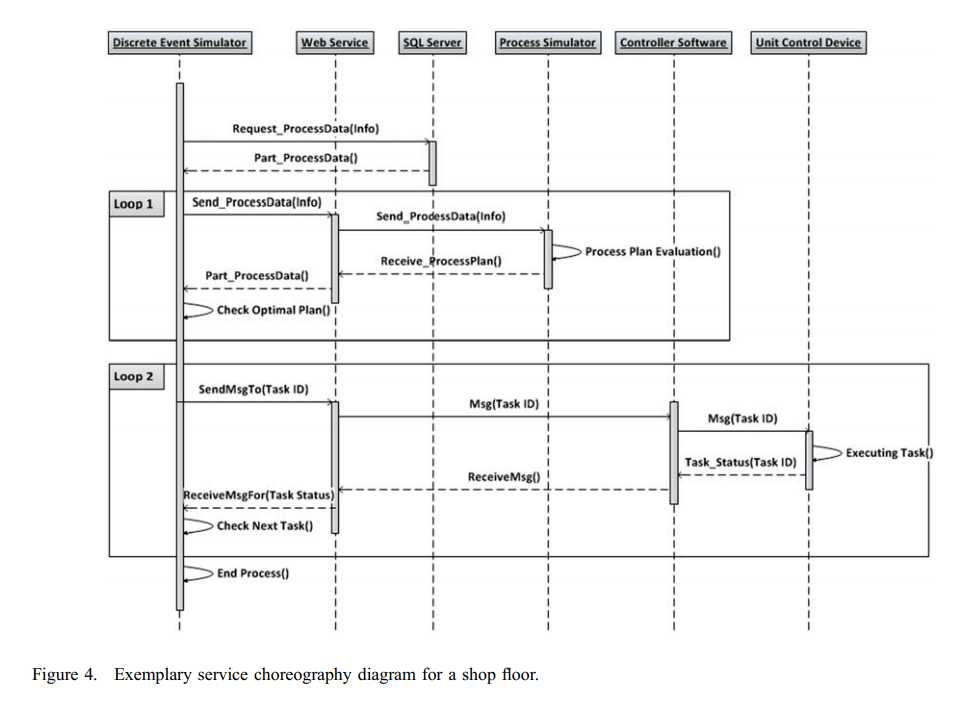

# Service-Oriented Architecture (SOA)

## Understanding the Dynamics of Service-Oriented Architecture Implementation (2015)

The authors [Xitong, L; Stuart, M](Dynamics_SOA_Implementation.pdf) interviewed multiple IT professionals and through a semistructured questionare attempted to answer _why embracing SOA work for some compoanys and not others_?

One of their key reasons was the `worst-before-better` phenomena, that caused many companies to abandon hope prematurely. For many interviewees the path to success was understanding that transforming to SOA would require `duration of committment` more than anything.

The authors explored this notion and found that often insufficient learnings would take place. These challenges led to frustration and the developers blamed the technology, instead of their training. Several identicial examples appeared with both the `PRO SOA` and `ANTI SOA` audiences, such as complexity to configure system. The more trained staff discovered patterns to centralize and decentralize these configurations, with high fluidity and best fit for the scenario capabilities. However, the non-trained staff found the different options available confusing and wanted a one-size fits all.

## A Hybrid Architecture Framework for Simulations in a Service-Oriented Environment (2017)

The authors [Erskine, H; Karsten, B; Martin, M](HybridFramework_Simulation_SOA.pdf) explore _Modeling and Simulation_ implementations in the context of Service Oriented Architecture. Their example centers around a system designed by the North Atlantic Treaty Organization (NATO) for wartime planning.

NATO used a collection of _loosely coupled system_ to model each component within their [WarGames](https://www.imdb.com/title/tt0086567/) system. As each component within the system interacts across a service contract, it became possible to have multiple implementations of each service; specifically `Live, Virtual, and Construction`.

These multiple implementations allowed for the simulation of virtually any scenario with a blend between both the physical and logical worlds.

Attention to categorization and definitions was given particular focus large parts of the paper.

## Multimedia Teaching Platform Construction for Fashion Design Based on Simulation and Synchronous Teaching System (2018)

The authors [Qu, P](MultiMedia_Platform_Based_on_Simulation.pdf) describes the role of SOA within the context of a _Fashion Design college course series_. Online educational platforms have a need to provide multi-media files to the students, however traditional monolithic systems are clunky to enhance.

Instead a case study is evaluated where SOA enabled the teachers to gain _capability agility_. An example includes new content publishing strategies that could be added and then updated inline without introducing additional risk to the previous system performance.

> Different from object orientation, SOA takes service as the basic unit of system construction. Each independent logic unit is integrated through deploying SOA. SOA can reduce the difference between the platform and programming language so as to achieve cross-platform development.

### What Implementation Patterns Exist

*Service agent implementation pattern*: in such pattern, the requester does not need to know the details of service provider about the service but gains the service through agent mode. Both parties do not establish the direct connection, as shown in Fig 1.

*Packaging service implementation pattern*: the pattern can gain SOA system through packing the existing functions into services and solves the integration problem between SOA system and the original system. Packaging can fully embody the advantages of SOA in cross-platform and cross-system, as shown in Fig.2.

*Virtual service implementation pattern*: such pattern combines the above two patterns. The main function is to offer the functions that existing services cannot implement. In other words, the function of existing system is converted to services first through the packaging service pattern, and then the conversion I conducted with the help of a service agent. Finally, Façade [10] mode is used to unify the difference between two services as shown in Fig.3.

*Service integration implementation pattern*: such mode can fully embody the advantage of SOA in recombination. The brand-new service is gained through recombination of workflow and combining different function demands. Such pattern contributes to improving system efficiency, reducing the pressure of service terminal and gaining the better exhibition effect, as shown in Fig.4.

*Event Service Broker (ESB) pattern*: as a common pattern, ESB-based SOA design pattern can solve service interaction and communication problem. Besides, it supports controllable distributed bottom framework and owns information sharing ability. The interaction methods of ESB mode include synchronous processing and asynchronous processing, as shown in Fig.5.

## A service-oriented simulation integration platform for hierarchical manufacturing planning and control. (2016)

The authors [Xu, D; Nageshwaraniyer, S; Son, Y](SOA_SimulatedIntegrationPlatform_for_HierarchicalManufacturing.pdf) provide "a coherent and comprehensive distributed simulation platform is proposed to support hierarchical manufacturing planning and control. This platform enables integration of various hardware and software components within and across supply chain members, such as manufacturing equipment, physics-based process simulators, system-dynamic, agent-based and discrete-event simulators (DESs), and databases via web services technology."

They describe that businesses are turning their supply chain strategies into globally distributed systems. These systems can be challenging to measure and simulate as they span multiple third-party businesses, each operating as a black box. Even the systems that are directly owned by the business are often legacy and hard to incorporate by default. Through the use of SOA these legacy systems and blackboxes (facades) can be connected together in such a manner as to mimic a reasonable approximation of the original system under test.

Section 2 of the article focuses heavily on the historical evolution of manufacturing simulation. There is a lot of attention to the challenges of legacy systems. Many experts believe that engulfing these legacy systems inside of SOA architectures is an economical solution for many scenarios.

### Why are simulations needed in these scenarios

Similar to [Erskine, H; Karsten, B; Martin, M](HybridFramework_Simulation_SOA.pdf), the authors were able to create facades around these physical plants, workstations, and employee agents. Then it became possible with high precision to evaluate the behavior when any subset of these physical constructs were replaced with a virtual instance. These virtual instances can then be used for fault injection and related capabilities to assess how the larger ecosystem would perform.

In general, it is suitable for military or industry areas having the following characteristics (Lendermann et al. 2003):

1. high variability and stochastic conditions in the production/work environment
2. complex task dependency, and operations including large amount of handshaking processes
3. possibility of structural changes in the supply chain.

It’s a very useful tool to set up realistic settings of a supply chain

### How was their simulation configured

The core idea centers around the hierarchial structure of: facade -> webservice -> legacy system, so that any aspect of the distributed supply chain could be replaced with a virtual instance. There are extensive details in Section 5 around each aspect of this design. 

