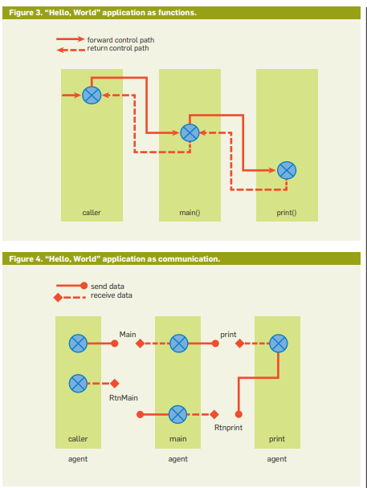

# Design Patterns

## Network Applications are Interactive (2018)

The author [Alappatt, A](NetworkApplications_Are_Interactive.pdf) describes the challenges of applying single machine programming patterns to networked applications. He proposes the notion of designing around communication and not sequential control structure. This approach leads to scenarios such as transforming the logic into _source and sink agent based solutions_.

## Consider two arithmetic expressions

> Y=X+A and A=B+C. With the sequential programs now in use, these are written sequentially as { A=B+C; Y=X+A }. The programs operate sequentially to get
the answer. If they are accidently written as { Y=X+A; A=B+C }, the program will continue to operate, but the answer will be wrong (i.e., a bug). Is there
a way to eliminate this anomaly? Imagine it a bit differently. In the same computation, the expressions run concurrently and combine when
A is shared—that is, the composition consists of two agents, A=B+C and Y=X+A, which operate concurrently (Figure 1). The right-hand side of an
arithmetic expression is a sink of the value and the left-hand side of the expression is a source of information. So in the case of A=B+C, B and C are sinks
and A is the source. A=B+C is resolved when B and C arrive and raise A. Meanwhile, Y=X+A is waiting on X and A. Assuming X has arrived, when the first
computation raises A, it is consumed automatically by the second computation to raise the answer Y.
>
> Notice in this case the agents run concurrently, but because the second agent is waiting on A, that is raised by the first agent. The two computations are concurrent. The two agents are combined but they expose the combination actions (i.e., they accept C, B, and X and produce Y). This eliminates the propensity of bugs caused by the out-of-order coding in sequential languages.

