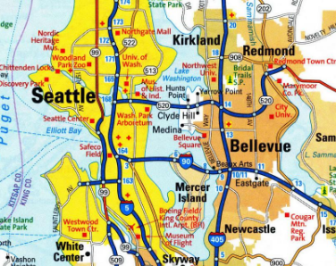

# Efficient Routing

## The Benefit of Perversity in Taxation Mechanisms for Distributed Routing (2017)

The authors [Brown, P; Marden, J](Perversity_in_Taxation_of_Distributed_Routing.pdf) study pricing as a means to improve the congestion experienced by self-interested traffic. When user price-sensitivities are unknown, it is not generally possible to incentivize optimal flows with static pricing. Nonetheless, recent work has derived non-trivial pricing that can be guaranteed never to be perverse; that is, for every network and every user population, the routing incentivized by these prices is never worse than un-influenced routing.

### What is the Price of Anarchy

The ratio of a Nash flow and the optimal flow is called _the Price of Anarchy_. This metric can be used to tell how the randomly selected actions of the arbitrary actors compares to the most efficient path forward. As the value increases there are wasted resources and increased latency that did not need to occur.

Much work has focused on tolls as a mechanism to reduce the price of ananary. Recently, interest has been growing in questions of robustness: how should a designer choose prices when the underlying system is uncertain or time-varying? Work along these lines has prescribed solutions for unknown or timevarying demand [11]–[13], unknown latency functions [14], and unknown networks and tax-sensitivities [2].

### What is Perversity of Routing

> As the price of anarchy is a worst-case metric, it may happen that pricing that minimizes price of anarchy for a class of problems need not perform well on particular problems in that class. *That is, optimizing worst-case performance could very well come at the expense of typical-case dperformance.* This is the purview of this paper: we seek to study specifically how much is lost on individual problem instances when minimizing the price of anarchy.

The `perversity` of networking is defined as the ratio of applying the `incentive / unincentivized solution`. For instance, there are two highways from Seattle to the East side - 520 (north) and i90 (south). A toll was added to 520 to encourage more public transportation. Drivers in the south were already using i90 were not did not change their behavior as the toll did not factor into their decision process. Similarly, others that required their vehicles for work, paid the toll and could not change the behavior. In both scenarios the _perversity of the toll_ is 1.

However, for a portion of the population they became incentivized and used the public transportation route or detoured. This change reduced the congestion across the 520 bridge and improved the experience for those that had no choice but to take it.

### Research Questions

Specifically, we ask the following questions:

1. If a system operator is willing to risk creating small perversities, can this improve the price of anarchy?
2. How perverse are the tolls that optimize the price of anarchy?
3. How can a designer explicitly enforce a constraint on the degree of perversity?

> [...], we show that to minimize the price of anarchy, a perversity strictly *greater than 1 is required*. We provide plots of the price of anarchy for various parameters, and prove that the price of anarchy of the best non-perverse mechanism is strictly worse than the best-achievable price of anarchy over all mechanisms, showing _that gains in the price of anarchy can only come at the risk of creating perverse incentives_.
> [...] In this paper, we pose a somewhat different question: rather than measuring how far the influenced flows are from optimal, it may be desirable to measure how much the taxes help with respect to the un-influenced flows.

To perform better than random a system needs to create incentives that are meaningful to the actors within that system. Simply creating barriers for the sake of creating barriers does not improve the situtation. Instead, one needs to identify meaningful mechanisms to promote efficient choices by those actors within the system.

