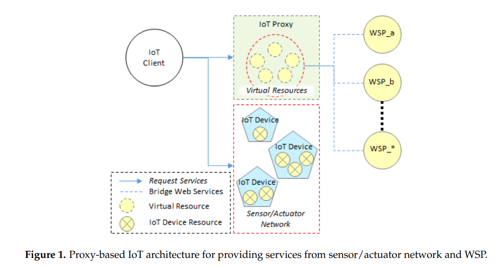
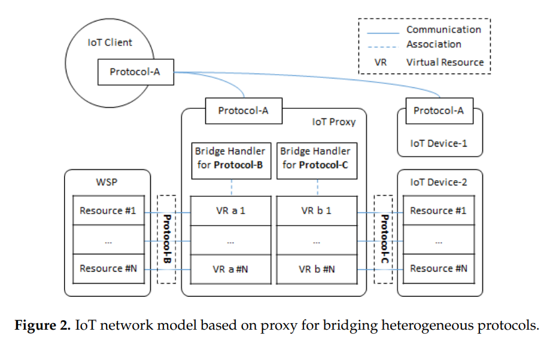

# Heterogeneous IoT Scenarios

## Development of Virtual Resource Based IoT Proxy for Bridging Heterogeneous Web Services in IoT Networks (2018)

The authors [Wenquan Jin ID; DoHyeun Kim](VirtualResource_IoT_Proxy_for_Heterogeneous_WebServices_in_IoTNetworks.pdf) discusses the challenges that arise with communication mechanisms among IoT devices. There are presently more IoT devices than humans and it almost seems like as many protocols, frameworks, libraries, and technology implementations. These heterogeneous ecosystems require solutions the abstract the differences and provide a coherent communication layer across them.

They propose the introduction of a web proxy layer that is both a simultaniously a service and client. When requests arrive to the server process, they are mapped to virtual resources and routed to IoT compute devices. These devices perform the operations and respond with the result. This proxy is designed to be compatible with the _Open Connectivity Foundation_ (OCF), a set of communication standards for IoT devices.

> Moreover, traditional web services are provided based on the Hypertext Transfer Protocol (HTTP), it is not possible to be revised to match the IoT challenges, and it needs to consider many underlying IoT-specific protocols [9]. Therefore, the proxy is necessary for bridging the different elements in the IoT environment. The proxy is an important element in the IoT network that supports protocol translation, registration, discovery, management, and other major functions [10]. The proxy is a necessary network element in the IoT which aims to enable communication between heterogeneous networks [11]

All communication between clients and devices goes through the proxy, and the proxy must implement a pub/sub model. This model is required so that low powered devices do not need to be on all the time. When they come online they contact the proxy and download the messages that were published, catching them back up to date.

> However, some devices on the Internet are not used for gathering information from the environment where the devices are deployed, rather they are
used to service provisioning, e.g., the WSP in the proposed architecture.

