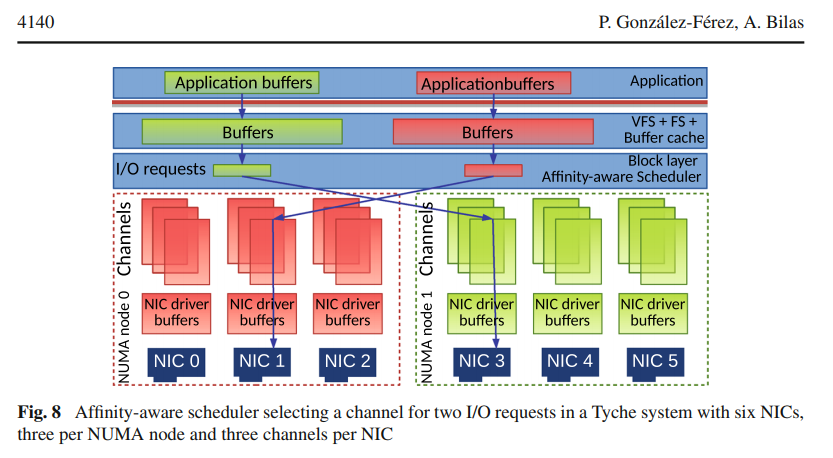

# NUMA and Storage

## Mitigation of NUMA and synchronization effects in high-speed network storage over raw Ethernet (2016)

The authors [Pilar González-Férez; Angelos Bilas](Migitations_of_NUMA_and_Sync_in_HighSpeed_NetworkStorage.pdf) state "[c]urrent storage trends dictate placing fast storage devices in all servers and using them as a single distributed storage system. In this converged model where storage and compute resources co-exist in the same server, the role of the network is becoming more important: network overhead is becoming a main limitation to improving storage performance. At the same time, server consolidation dictates building servers that employ non-uniform memory architectures (NUMA) to scale memory
performance."

This would suggest that there are two competiting trends that need to be reconsiled. For instance, many enterprises are moving their infrastructure to virtual servers hosts; which reduces CAPEX by increasing density on each physical machine. However, these virtual servers rely on networking to local disks versus tradition Storage Area Networks (SAN) solutions.

Different services within these storage networks are able to perform the persistence operation, at different rates. This scenario makes sense as e.g., a virtual magnetic disk trades performance for cost, versus an in-memory story is going the other direction. Because these different trade-offs exist with different supported latencies -- it is therefore performance critical to understand when/how to apply them.

### What is Tyche

The researchers created an in-house protocol that runs at [the Enternet level](https://github.com/dr-natetorious/TIM-7010-Computer_Networks_and_Mobile_Computing/tree/master/Section_1_SDN/Week2_Challenges/Readings/Modeling#the-osi-model--what-it-is-why-it-matters-why-it-doesnt-matter-2011) and measures the end-to-end path route performance.  

### Why use Ethernet not Infiniband

Infiniband is a technology for ultrafast connectivity between systems that gains efficiency by lowering the overhead of the transmission protocol (compared to IP). However, ethernet is still the dominant solution in nearly every data center solution despite these overheads.

> As Ethernet is starting to be used for accessing storage in the data center, protocol overheads are becoming a main concern. For instance, with high-end storage devices, a server can be spending as many cycles for serving remote storage requests as serving the application itself. Therefore, the network protocol used on top of Ethernet plays a significant role in achieving high efficiency for storage access.

If these protocol limitations can be overcome then Ethernet is a cost efficient medium that has already been deployed across the environment. For instance, additional NICs can be added to servers to horizontally scale performance.

> Scaling networked storage throughput on such servers is becoming an important challenge. Therefore, it is essential to explore how network protocols can be designed to cater to affinity among memory, cores, and network interfaces (NIC) for data and protocol data structures.
> The second important issue is that making transparent use of multiple NICs and network links to increase I/O throughput from a large number of cores introduces synchronization and lock contention issues. Locks cause serialization, reduce parallel efficiency over multiple NICs, and eventually hurt performance and scalability [7–10], especially as the number of cores and NICs increases.

### How does Tyche improve performance

The analysis showed that lock contention causes up to 2x performance degrade; to mitigate this they queue the storage writes and then use a small number of threads to dequeue. While there is a thread context switch, the cost versus serializing the write are trivial. They also introduce a notion of an "end-to-end channel" so that physical adapters and remote memory can be determined up front. This approach enables the operating system to avoid excessive copy operations and instead rely on remapping of shared/virtual memory pages.

They spent a significant amount of attention to the critically of NUMA affinity within a worker process, as this can easily influence performance by around 17-24% throughput. Additional investigations are required around dynamic NUMA aware scheduling and how they can be transparently integrated into the operating systems.

