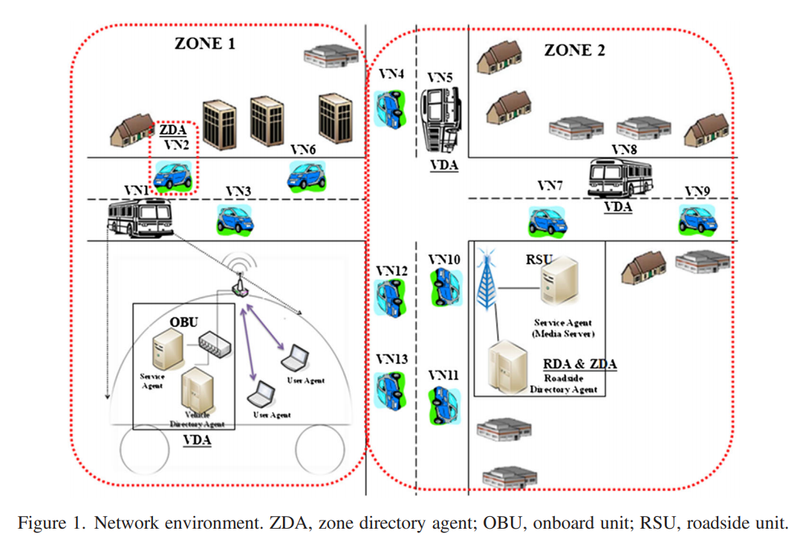
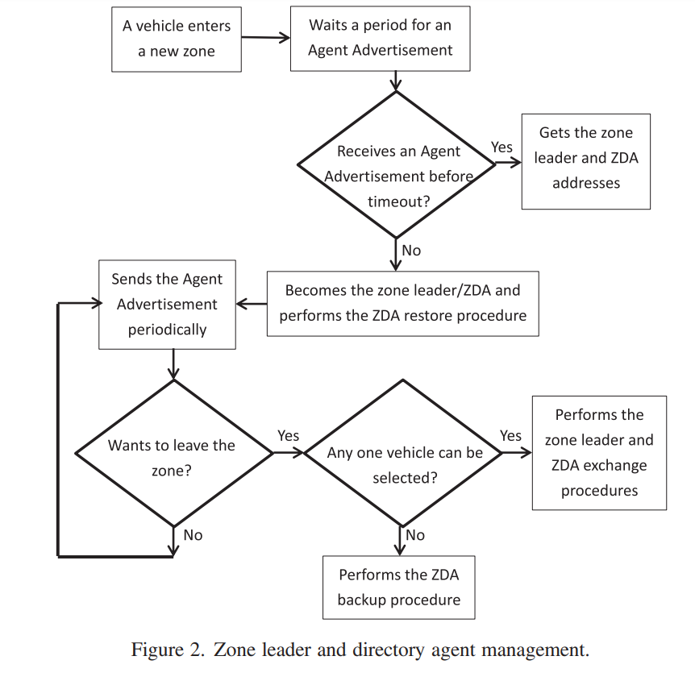

# Service Discovery in Vehicular/Mobile Ad Hoc Networks (MANET/VANET)

## Integrated service discovery architecture for heterogeneous networks (2016)

The authors [Chen, M; Sung F](Integrated_ServiceDiscovery_Heterogeneous_Networks.pdf) propose design requirements to service discoveyr in ad-hoc vehicular networks. Many research projects, standards, and protocols have been proposed to deal with service discovery problems on either the network layer or the application layer. These approaches can be further divided into three types of architectures:

- centralized directory-based service discovery [3–5]
- directory-less-based service discovery [6–9]
- distributed directory-based service discovery [10–22]

It is a challenge to design a service discovery mechanism that simultaneously provides reduced:

- network overhead
- faster service response time
- a higher service hit ratio
- better network scalability.

Most current service discovery protocols are designed for infrastructure networks, mobile ad hoc networks (MANETs), or vehicular ad hoc networks (VANETs) [17, 18]. However, no service discovery mechanism currently works in a heterogeneous environment, which can comprise infrastructure networks, network mobility (NEMO) [23] environments, VANETs, and VANETs with NEMO.

This paper offers three key contributions. First, the proposed mechanism can provide service discovery in heterogeneous networks. Second, the proposed mechanism can provide a higher discover hit ratio. Third, based on the proposed environment, structured peer-to-peer (P2P) systems, such as Chord and Content-addressable Networks, can be implemented in VANET.

### How have implementations varied over the years

A common strategy is to have a centralized server/agent that manages the catalog. This can introduce challenges as its a single point of failure and can be difficult to ensure its address is known in advance (within ad hoc networks).

Other technologies, such as _Microsoft's Universal Plug and Play_ (UPnP); rely on multi-cast broadcasting of service capabilities. Some networks scenarios, e.g. cellphone networks, NAT environments and certain virtual provide cloud implementations, might prevent these broadcasts packets.

Apple's Bonjour extends the capabilities of traditional Domain Name Services (DNS); to provide service discovery through core infrastructure solution that already exists in most scenarios. It is limited to only local networks (LAN).

### What are distributed directory servers

In larger networks these broadcast technologies cannot be used as they require too much bandwidth. If thousands of machines, are notifying thousands of machines, on a regular cadenance; the aggregate volume would be too much load. This suggests that a solution somewhere in the middle is needed; in that it should be hierarchial tiered -- not a single root node nor only leaf nodes.

> There have been many takes on this approach, such as Group Service Discovery. However, GSD suffers from high message overhead in loop situations. The Chord approach [15] organizes directory servers in a logical ring network using an elaborate service discovery mechanism. However, Chord was designed for use in overlay networks.
> [...]
> the Mesh-enhanced Service Location Protocol (mSLP) [16] has each Directory Agent (DA) establish a peer connection with other similar DAs with a shared scope. The DAs then periodically exchange advertisement messages to maintain the peer relationship. Each DA also exchanges new service registrations via message forwarding. Thus, mSLP improves the consistency among peer DAs by automatically sharing registrations and provides registration information recovery when the DA is rebooted.

While this approach is effective it cannot be applied to VANET and certain MANET scenarios, as the users are physically moving and can drift outside of the tranmission range.

### How are VANET discovery protocols categorized today

> The service discovery mechanisms for VANET can be categorized as _vehicle-to-infrastructure (V2I) and vehicle-to-vehicle (V2V)_. In V2V, the Vehicular Information Transfer Protocol (VITP) proposed in [19] is an application layer protocol designed to support data dissemination over VANETs.
> [...]  Geocache was proposed to allow for sharing and exchanging of traffic information using P2P communication in VANETs. Geocache uses the pull-based geocast protocol to efficiently collect and disseminate data.
> [...] In V2I, the Address Based Service Resolution Protocol (ABSRP) proposed in [29] uses the roadside unit (RSU) to provide the service discovery in VANET.

### How can these ecosystems be efficiently partitioning

These VANETs can be partitioned into virtual zones and through a combination of V2I and V2V technologies, gain the best of both worlds. Devices can communicate with other objects that *reside in the same scope* (e.g. passengers on a bus); and that bus can communicate with _roadside units_ at intersections.

Objects within a zone eventually parent up to a _Zone leader_, that is responsible for managing the container objects as they move about. If the e.g., bus is about to enter another zone (determined by trajectory); then the Leader needs to transfer the relevant state to the peer.

This scheme is called `Zone Directory Agents` (ZDA) can be efficiently applied to enormous and micro sized networks a like. As the node count increases, so does the number of scopes levels. Each scope remains at a manageable number of objects across the hierarchy.

> However, when vehicles move at high speed, VANETs can behave very dynamically, and topologies change very quickly; thus, the traditional hierarchical directory agent architecture is not suitable for VANETs. Therefore, this paper introduces the ZDA exchange and backup mechanism into the P2P service directory agent architecture to provide service discovery between the SLP DAs for heterogeneous networks.

### How is the zone leader selected

The proposed architecture allows either V2I or V2V; with a preference of an RSU as the leader. This makes sense as it is a fixed unit of compute and is unlikely to leave the zone its managing. When an RSU is not available, then the protocol selects a vehicle at semi-random to be the leader (sort by duration in the zone). In either scenario, the goal is to find something as fixed as possible to avoid redudantly forcing a re-election.

If it is not possible to select a local ZDA, then the protocol needs to fall back to the nearest peer ZDA or promote the vehicle to ZDA.

### How can the reliability be further improved

One approach is to have each vehicle identify three leaders, each selected to form a triangle around its locality. Then local caching can be introduced, so that outages in communication can fallback to the other leaders secondary responses. The researchers found that this improved the reliability even at higher speeds.
