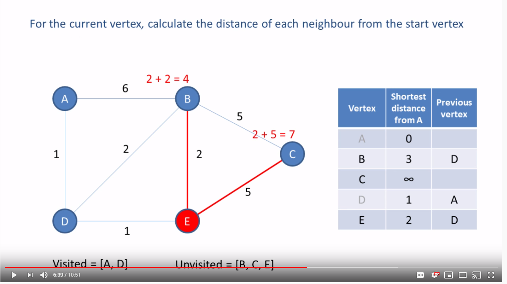
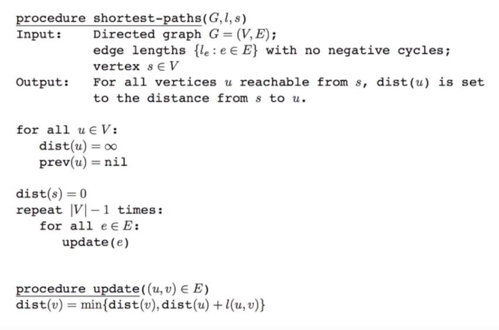
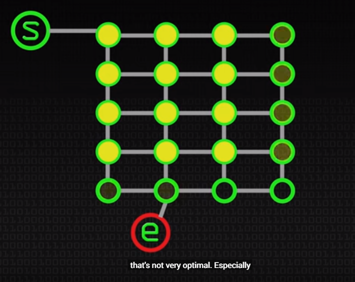
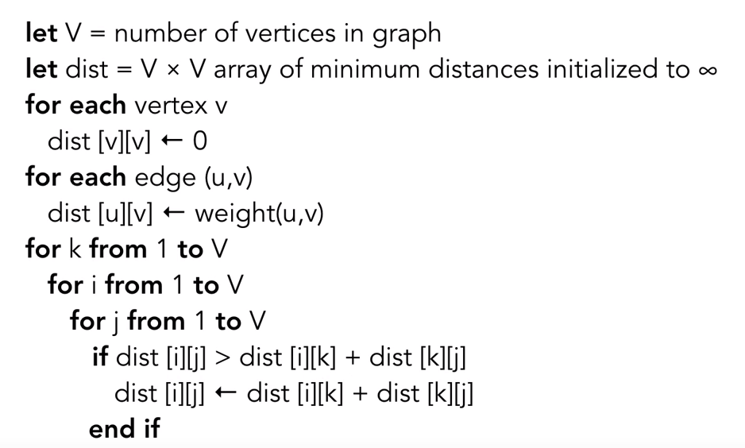
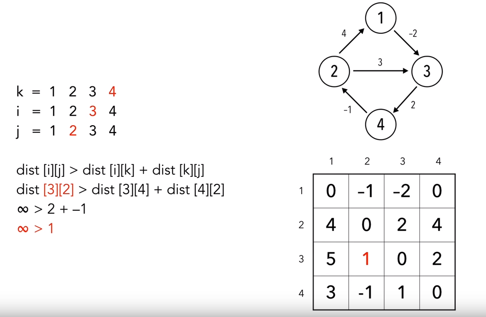
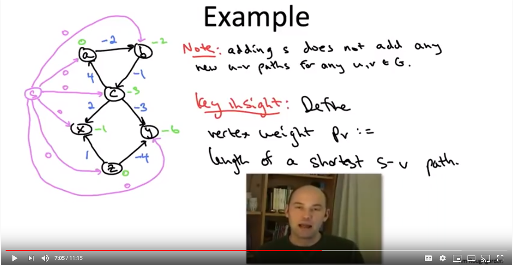
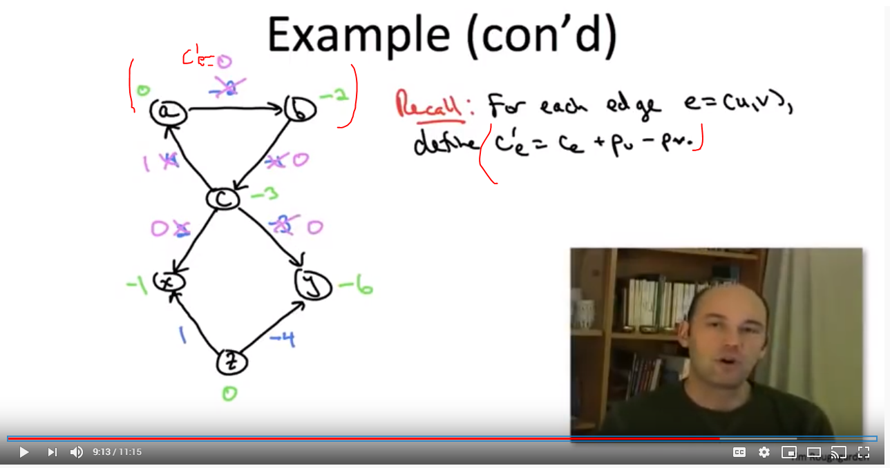
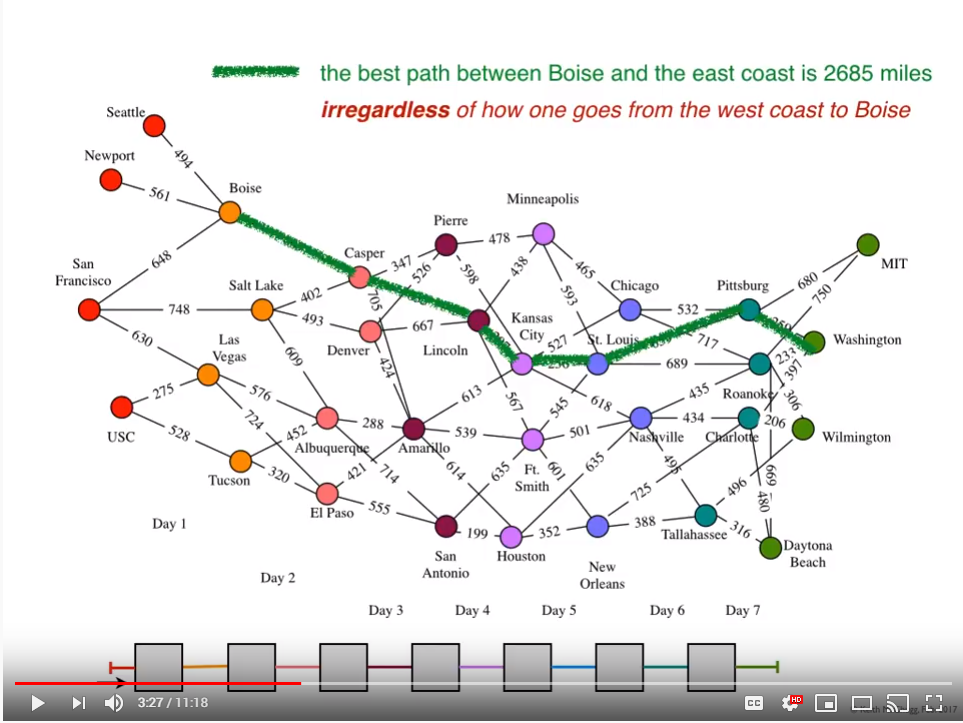
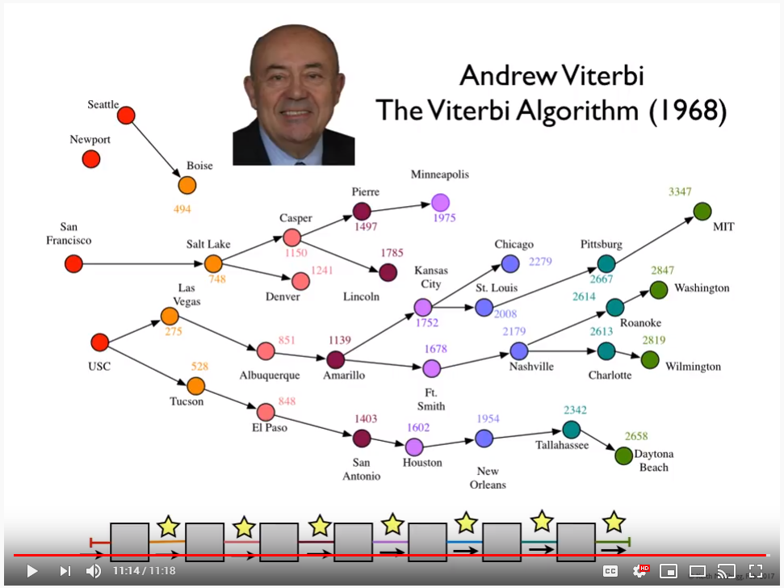
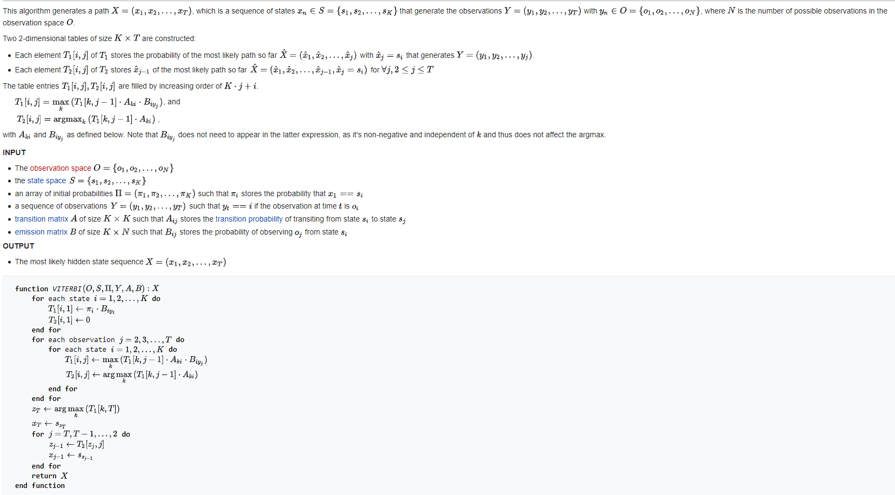

# Shortest Path Algorithms

## Dijkstra's algorithm

The key objective of this algorithm is to calculate the shortest distance from a starting point, to every other vertex in a graph.

The strategy [attempts to build a table](https://www.youtube.com/watch?v=pVfj6mxhdMw) that specifies the distance to each vertex and its previous vertex. Then the shortest path can be determined by looking at the previous vertex column and walking back to the starting point.

At each iteration of the process, the _unvisited vertex with the shortest distance in the table_, is selected and then its edges are traversed in ascending order. As each edge is enumerated the `distince = starting_point + edge_weight` is compared against the current cost to reach that locaiton. If it is less, then the table is updated to signify a better route.

```c#
Map Dijkstra(Graph, start_point) {
    var shortest_path_table = Map<VertexId, Distance, PreviousVertex>;
    var visited, unvisited = list

    // Init
    foreach (Graph.vertex) {
        shortest_path_table.Add(vertex, infinity, null);
        unvisited.Add(vertex)
    }

    // Tag the starting point
    shortest_path_table[start_point].distance = 0

    // Loop until every node is visited
    do
    {
        var vertex = pop_shortest_distance_from_unvisited()
        foreach (edge in vertex.edges ordered ascending) {
            var path_distance = vertex.distance + edge.weight
            var other = shortest_path_table[edge.to];

            if (other.distance > path_distance) {
                other.update(path_distance, vertex);
            }
        }
    } while(unvisited not empty);

    return shortest_path_table;
}
```



## Bellman–Ford algorithm

The critical enhancement of Bellman-Ford is [the ability to tolerate negative edge weights](https://www.youtube.com/watch?v=9PHkk0UavIM). However, it does not support negative cycles. If a negative cycle exists, then the shortest path cannot be solved, as performing another loop is even smaller value.

BF is able to handle negative weights by not being a greedy algorithm, and enumerating |V|-1 times and updating the minimum distance of all nodes.



## A* search algorithm

Another challenge with Dijkstra's algo is the calculation of the current shortest path, even if [the step doesn't improve our goal](https://www.youtube.com/watch?v=ySN5Wnu88nE).



A* enhances the previous algorithms to include a heuristic of how far do we need to go. An example heuristic could be the `euclidian distance` from the vertex to the destination. Then `distance = start_point + edge_weight + heuristic`, which naturally forces a preference towards the lowest heuristic (and correct direction).

The strategy also leverages a priority queue that is sorted on the current shortest path. At the end of each iteration, the `first(priority_queue)` vertex is always chosen, until the end is reached or all vertexes are visited (no solution).

Since this strategy does not evaluate most of the vertexes, it has a much lower memory footprint and computational overhead.

## Floyd–Warshall algorithm

Dijkstr'a algorithm finds the shortest path from a _single node_, versus Floyd-Warshall finds [for _all vertice pairs_](https://www.youtube.com/watch?v=4OQeCuLYj-4). It also supports negative weights, similar to Bellman-Ford.





## Johnson's algorithm

It starts determines the _all pairs shortest path_, with support for negative weights. This algorithm uses a [series of transforms](https://www.youtube.com/watch?v=xc2ua8sQAoE) to get a directed acyclical graph (DAG) into a normalized form, then Dijkstra's algorithm can be executed to get the final answer.

1. Create a new single source vertex (S), that connects to all other vertice with weight of zero.
2. Apply Bellman-Ford to get the shortest paths from (S) to each vertice
3. Each vertice is re-weighted using the values of step (2)
4. The reweight of each `edge_cost = dist(u,v)` becomes `edge_cost' = dist(u,v) + head - tail`




## Viterbi algorithm

A [many-to-many strategy](https://www.youtube.com/watch?v=6JVqutwtzmo) that finds the most efficient path across a multi-dimensional graph. The algorithm relies on an _Additivie, Compare, Eliminate_ approach to prune branches down to the best survivors.

For instance, what is the most efficient route from coast-to-coast that takes 7 days and each stop is maximum of 750 miles? This can be derived by:

1. Chose a random starting at hop 1 and ending on the last hop
2. Determine the best choices for getting to that point
3. Prune the paths that would not have been taken
4. Increment one hop
5. If not at last hop, goto (2)




