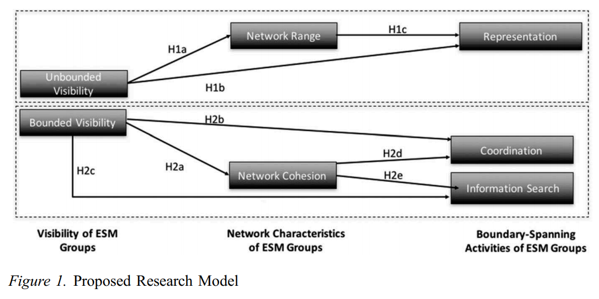

# Enterprise Social Media

## Strategic Visibility in Enterprise Social Media: Implications for Network Formation and Boundary Spanning (2018)

The authors [Van Osch, W; Steinfield, C](StrategicVisibility_in_ESM_for_Network_Formation_and_Boundary_Spanning.pdf) state that "Effective workgroups engage in team boundary spanning, that is, using communication ties as conduits to critical external resources."

> The recent emergence of enterprise social media (ESM) as a new class of organizational information systems has sparked substantial interest among academics and practitioners alike as offering unprecedented opportunities for breaking down knowledge silos in organizations and facilitating more effective and efficient cross-boundary knowledge sharing.
> [...]
> We find support for our basic argument that different visibility conditions are associated with different network structures, and network characteristics are, in turn, associated with distinct team boundary-spanning interactions. A preliminary qualitative analysis of the language used by group creators to describe the objectives of the group further suggests that visibility choices may indeed be purposeful and strategic.

### What is boundary spanning

One of the challenges within organizations is devising mechanisms for communication between different teams. Previous works have focused on only active participants, however this is scoped too small. Consider the value gained by passive participants as they acquire general information of the organizational conversations.

As these mechanims are formed they lead to:

- Representation: ambassadorial function or impression management
- Coordination: task and interprocess communication
- General information search: cross pollination of ideas

### Why is it difficult to gain participation

> Although most of the ESM literature to date has focused on the positive effects of visibility for social capital formation and knowledge sharing, recent work suggests there are reasons that employees may not be willing to contribute or retrieve information on ESM [56], and even argues that visibility could actually discourage employees’ willingness to post information due to concerns over loss of control, job security, or accidental knowledge spillovers.
> [...]
> Thus, from a network perspective, groups characterized by bounded visibility afford more cohesive network structures encompassing individuals who know each other from previous interactions— that is, display characteristics of strong ties—and thus may create ideal opportunities for coordination, negotiation, or the sharing of sensitive information as a result of the trust, shared identity, shared understanding, and reciprocity norms that exist in these cohesive networks.

### What are the advantages of unbounded groups

When unbounded groups develop a broad network of external ties, group members are more likely to frame their initial request in such a way that a diverse audience of recipients can understand the request.

However, these will be more heistation to sharing information compared to bounded groups. "[B]ecause of the group’s bounded visibility, the evolving relationship building that is ongoing within the group is unlikely to be disrupted from outside the group. The lack of interruptions fosters a shared memory system, strong coordination norms, shared identity and understandings, psychological safety, as well as trust and mutual respect among members of the closed group."

### Building a framework around these ideas

Hypothesis 2a: Groups with bounded visibility will display greater network cohesion than groups with unbounded visibility.

Hypothesis 2b: Groups with bounded visibility will display more coordination activities than groups with unbounded visibility.

Hypothesis 2c: Groups with bounded visibility will display more information search activities than groups with unbounded visibility.

Hypothesis 2d: The network cohesion of a group will positively mediate the relationship between the bounded visibility of the group and the amount of
coordination activities enacted by the group.

Hypothesis 2e: The network cohesion of a group will positively mediate the relationship between the bounded visibility of the group and the amount of
information search activities enacted by the group.

