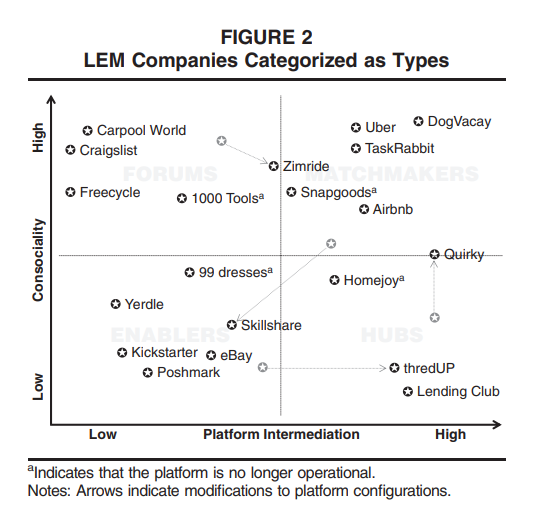

# Logistics as a Service

## Lateral Exchange Markets: How Social Platforms Operate in a Networked Economy (2018)

The authors [Perren, R; Kozinets, R](LateralExchangeMarkets.pdf) explore "Lateral exchange markets (LEMs) are sites of technologically intermediated exchange between actors occupying equivalent network positions." These topologies are naturally occurring in scenarios such as: _peer-to-peer sharing_; _gig economy_ (e.g. AirBnB, Uber, ...); and _pay per use systems_ (e.g. Zipcar and Redbox).

They intentionally avoid using the term `peer` as it suggests that the third-party is an amature, in reality 20-40% of the "share economy" is operated by professionals (property management firm -> AirBnB) or former-professionials in a related trade (eg. taxi -> uber driver). For this reason `LEMs` are the preferred term for describing these scenarios.

> Therefore, in contradistinction to prior conceptualizations, we aim to build a general understanding about these markets that conceptualizes them as (1) a broad marketplace phenomenon with internal differences, (2) a manifestation of technology platforms linking actors, (3) including the possibility for exchange of ownership and not merely access, (4) excluding sharing and gifts, and (5) including both amateur (“peer”) and professional actors.
> We define a lateral exchange market (LEM) as a market that is formed through an intermediating technology platform that facilitates exchange activities among a network of equivalently positioned economic actors.

### What are the types of LEMS

- Distinct value propositions of LEM types
- Forums connect actors
- Enablers equip actors
- Matchmakers pair actors
- Hubs centralize and standardize service flows

### What is the point

> After examining a large set of LEMs and analyzing how they function, we develop four LEM types. The types have two underlying trust-related dimensions: [1] the extent of consociality between actors and [2] the extent of intermediation of the platform.

This conclusion can be applied to distributed software systems by understanding where a system fits on these dimensions. If it drifts too far in any direction then compensations are required to ensure a safe and reliable platform. The authors use the extreme of Craiglist with _high consociality and low platform intermediation_ -- that offsets the high risks with user training.

Understanding these mesh networks is important, as not all ecosystems can be fully trusted. Consider a Mobile Ad Hoc Network (MANET) as discussed with [Context Centric Cluster Computing (C4) in Ad Hoc Network (2016)](../../Week1_Fundamentals_Hardware/Readings/Autoscale/README.md) where ad hoc users use thier mobile devices as packet forwarding devices. Without secure design considerations, any of these forwarding devices could manipulate the transmission to include malware or bogus results.

## LOGISTICS-AS-A-SERVICE: ONTOLOGY-BASED ARCHITECTURE AND APPROACH (2013)

The authors [Sandkuhl, K; Lin, F; Shilov, N; Smirnov, A; Tarasov, V; Krizhanovsky, A](Logistics_asa_Service.pdf) state that "Cyber-Physics System (CPS) is a relatively new term assuming tight integration of physical systems and cyber (IT) systems interacting in real time. Such systems aim at providing a flexible and extensible infrastructure supporting a variety of inputs (e.g. sensor-based and customer needs) and outputs (actuators or indicators/displays). CPSs rely on communication, computation and control infrastructures to provide for efficient utilization of logistics infrastructure resources."

> The increasing interconnection of information systems or production planning systems in enterprises with CPS is of high importance for numerous application domains, e.g. transport and logistics, automation and production, or the factory of the future, just to mention a few examples.
> Logistics-as-a-Service (LaaS) is a logistics network of organizations, people, information and resources supported by service-oriented CPS.

### What is Wiktionary

A free open source dataset of machine readable mappings between _a base word_ and _related words_. These mappings can be consulted to reduce the ridged literal values that would otherwise be required in _description matching_.

### What is Ontology Matching

The technical term for description matching is _Ontology Matching_, and is defined as the process of finding related terms. These terms might span different datasets such as 'fish' and 'le fish' (or whatever French people call fish).

## Putting it all together

Logistics-as-a-Service architectures allow us to create _Factories of the Future_, where goods and services are decentralized and distributed across multiple private facilities. These physical networks can then be combined through _Cyber to Physical Systems_ and exposed as standardized web service interfaces.

These services enable the capabilities for third-parties to build user experiences or integration points (e.g. mashups) into their private solutions. As logistics moves in this direction, costs for the service provider are reduced as their inventory on hand is reduced further. Taking this idea one step further, these resources do not need to be "books and food" but could also be compute and storage. This mentality naturally segways into the evolution of business giants such as Amazon and Alibaba.
