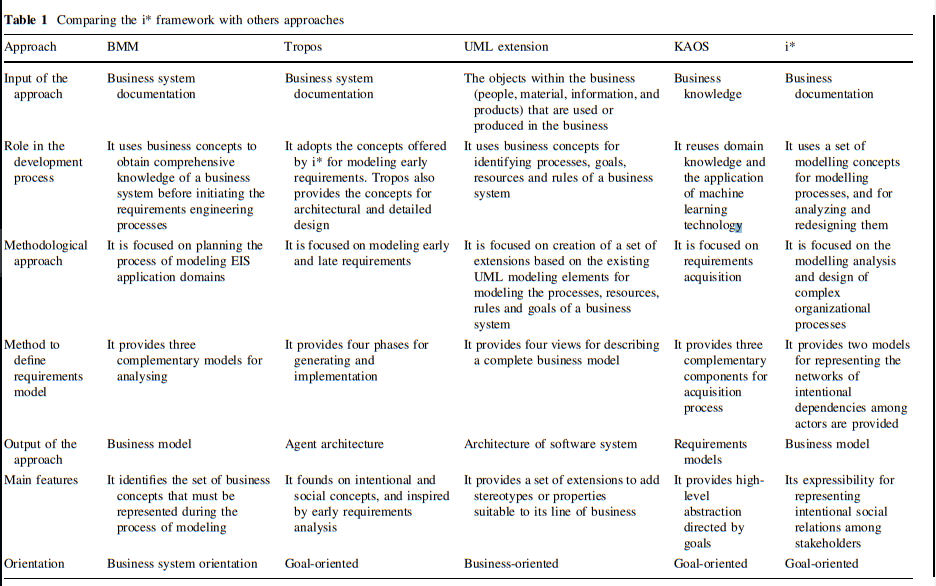
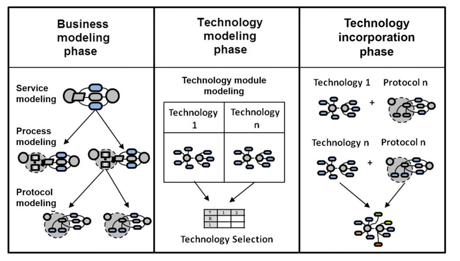

# Process Modeling

## Incorporating technology in service-oriented i* business models: a case study (2017)

The authors [Martinez, A; Vazquez, B; Estada, H; Santillan, L; Zavala, C](Incorp_SOA_BusinessModels_CaseStudy.pdf) reviewed the need for [I*](https://en.wikipedia.org/wiki/I*) modeling, a `conceptual` high level systems design framework, to include the notion of abstract technology. They argue that by incorporating systems technology in these early designs it leads better coupling of business goals with system design.  

    Despite the fact that information technology experts agree on the idea that business process and information technology design are key elements in the software development phases, there are still gaps in modeling the business processes and the technology together (Bandara et al. 2007). We argue that the study of business processes must not be an isolated task and should always be related to information technology.

### How does i* fit in the larger picture

    i* is one of the most well-founded organizational modeling techniques (Yu et al. 2011). Its main feature is its expressibility for representing intentional social relations among stakeholders. i* mainly focuses on: (a) the representation of social and intentional relationships mainly of the network of actors of an enterprise, and (b) the representation of the internal behaviors required to satisfy actor dependencies.

### How should one apply i* modeling

This way, instead of having to deal with each function defined in the business model, an abstract representation of services can be used to create
relationships with technology modules. This approach is carried out in three phases:

1. The business modeling phase
2. The technology modeling phase
3. The technology incorporation phase

After following these steps the conversation should more naturally flow from high level business goals toward the right technology solutions. During the progression of that conversation, the vocabularity between the deciplines should stay aligned as there is a clear alignment between `why and how`.

