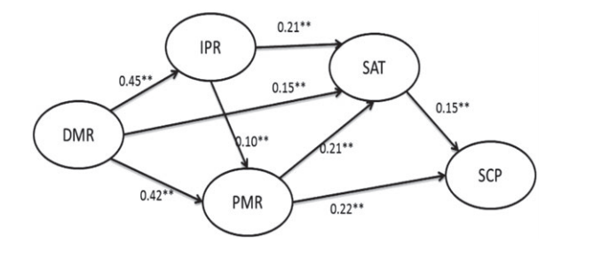

# Resource Based View

## The impact of supply chain analytics on operational performance: a resource-based view (2014)

The authors [Chae, B; Olson, D; Sheu, C](SupplyChainAnalytics.pdf) seeks to understand the role of _Supply Chain Analytics_, as it related to a _resource-based view_. Their goal is to determine strategies for improving operational performance and customer satisfaction.

> We define the architecture of SCA as the integration of three sets of resources, `data management resources (DMR), IT-enabled planning resources (IPR) and performance management resources (PMR)`, from the perspective of a resource-based view.

Supply chain management is a growing area of interest as these business analytics enable the enterprise to be more competitive. Customer's want their goods delivered in near real-time. However, there are challenges with efficiently pre-caching these goods in facilities near the customer without potentially retaining additional inventory. These additional inventory represents risk to the business as (1) it might be purchased and (2) represents cash that could have been spent for other goods.

> SCA research is in its early stage and there is a general lack of theory and of empirical studies. Using the resourcebased view (RBV) as the theoretical base, this study expands the understanding of components and performance of SCA. The principal idea of the RBV is that the competitive advantage of a firm lies in its heterogeneous resources, which are valuable, inimitable and non-substitutable (Barney 1991).

### What is the Resource Based View of SCA

> The RBV holds that resources vary across firms, and differences in resource levels that persist over time enable firms to sustain competitive advantage (Penrose 1959; Wernerfelt 1984; Barney 1991). Under RBV, various technological and organisational practices can be considered resources for acquiring sustained competitive advantage. For instance, organisational knowledge, managerial skills, backend integration, technology and manufacturing facilities are viewed as manufacturer resources (Dong, Xu, and Zhu 2009).
> ...
> The emergence of new terms, such as SCA, reflects a broad interest in leveraging the business value of supply chain data and harnessing the power of various analytical technologies and methods. Top performing companies are better at utilising their data for business planning and execution (Kiron et al. 2011; Lavalle et al. 2011) and this has led to the increase in supply chain integration and visibility (Viswanathan and Sadlovska 2010; O’dwyer and Renner 2011).
> ...
> [F]irm resources (e.g. IT) as a source of sustained competitive advantage are used to conceptualise SCA, to test the relationships between different SCA-related resources and to predict their impact on supply chain planning satisfaction and operational performance.

Essentially, everything within an organization is a resource and IT-enabled resources are a subclass. As these IT-enabled resources are paired with data they become more intelligent and can allow the business to make smarter decisions. It is therefore advantageous to identify and expand on the benefits of DMR + IRP and PMP.

> For example, IT-based planning reveals forecasting errors, overstocks and other issues, which require coordination to fix. As a result, IPR is expected to increase the need for performance management. Firms are likely to increase relevant resources for performance management. [...] The RBV of SCA
indicates that DMR and IPR are more technological than organisational, while the opposite is true for PMR.

This diagram shows the correlation coefficient between the different concepts, based on the feedback of 571 manufacturing experts responses.

> These findings shed light on the importance of firms’ DMR for SCM activities and performance. Few studies have empirically examined the impact of DMR on Supply Chain Management (SCM). [...] There is empirical support that SCA positively impacts outcome variables: supply chain planning satisfaction (SAT)
and SCM performance (SCP). We find that all three sets of IT-enabled resources (DMR, IPR and PMR) have a positive impact on supply chain planning satisfaction (SAT). On the other hand, the correlation of DMR and IPR with SCP is found to be statistically insignificant (Table 4). This
implies that IT-enabled resources for data management and supply chain planning are important, but do not seem to create business value themselves. Instead, DMR and IPR, which are more technological resources for SCA, have an indirect impact on SCM performance through complementary resources, PMR.

